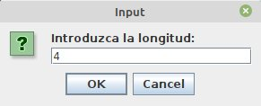
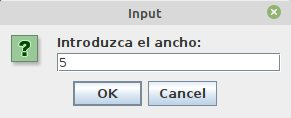
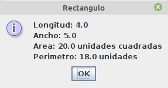

# Ejemplo 1 #

## Resumen ##
Programa que calcula el area y el perimetro de un rectangulo.

## Codigo ##

El código solución se puede encontrar en el archivo [Rectangulo.java](Ractangulo.java) cuyo contenido se muestra a continuación:

```java
//Este programa en Java determina el area y el
//perimetro de un rectangulo.

import javax.swing.JOptionPane;

public class Rectangulo {

    public static void main(String[] args) {
        double ancho, longitud, area, perimetro; //Linea 1
        String lengthStr, widthStr, outputStr; //Linea 2
        lengthStr = JOptionPane.showInputDialog("Introduzca la longitud: "); //Linea 3
        longitud = Double.parseDouble(lengthStr); //Linea 4
        widthStr  = JOptionPane.showInputDialog("Introduzca el ancho: ");//Linea 5
        ancho = Double.parseDouble(widthStr); //Linea 6
        area = longitud * ancho; //Linea 7
        perimetro = 2 * (longitud + ancho); //Linea 8
        outputStr = "Longitud: " + longitud + "\n"
                + "Ancho: " + ancho + "\n"
                + "Area: " + area + " unidades cuadradas\n"
                + "Perimetro: " + perimetro + " unidades\n"; //Linea 9
        JOptionPane.showMessageDialog(null, outputStr,"Rectangulo",JOptionPane.INFORMATION_MESSAGE);//Linea 10
        System.exit(0); //Linea 11
    }
}
```

## Empleo ##
A continuación se muestra el programa anterior en acción:
1. Solicitud de la altura:




2. Solicitud de la base:
   


3. Despliegue de los resultados:
 
