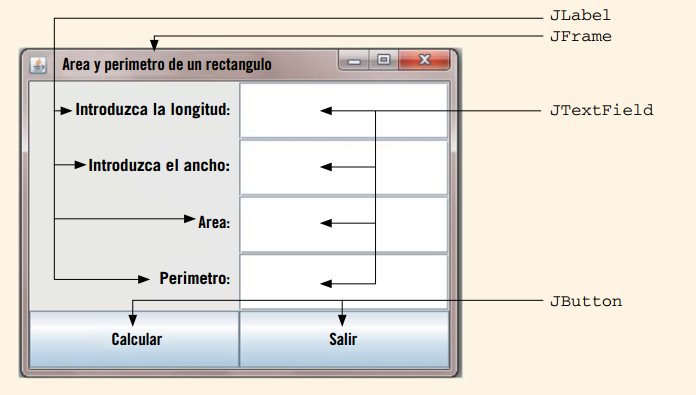

# Ejemplo 2 #

## Resumen ##
Programa que calcula el area y el perimetro de un rectangulo. Como la interfaz de usuario que se crea es mejorada con respecto a la anterior se muestra el proceso de codificación por pasos hasta llegar al diseño final de la aplicación; la parte de la logica se implementará en el [ejemplo 3](../ejemplo3).

## Bosquejo del diseño ##

A continuación se muestra como se desea que sea la interfaz grafica:


Los componentes a emplear para el caso se muestran a continuación:



En la siguiente sección vamos a proceder a crear la interfaz grafica gradualmente.

## Codigo ##

1. **Inicialmente se crea la ventana**: Para el caso el codigo asociada fue [RectangleProgramOne.java](RectangleProgramOne.java)


```java
//Programa Java para crear una ventana.

import javax.swing.*;

public class RectangleProgramOne extends JFrame {

    private static final int WIDTH = 400;
    private static final int HEIGHT = 300;

    public RectangleProgramOne() {
        setTitle("Area y perimetro de un rectangulo");
        setSize(WIDTH, HEIGHT);
        setDefaultCloseOperation(EXIT_ON_CLOSE);
        setVisible(true);
    }

    public static void main(String[] args) {
        RectangleProgramOne rectProg = new RectangleProgramOne();
    }
}
```

El resultado al ejecutar este código fue el siguiente:


2. **Se agregan las 4 etiquetas (labels)**: Para el caso el codigo asociada fue [RectangleProgramTwo.java](RectangleProgramTwo.java)


```java
// Programa Java para crear una ventana y colocar cuatro etiquetas

import javax.swing.*;
import java.awt.*;

public class RectangleProgramTwo extends JFrame {

    private static final int WIDTH = 400;
    private static final int HEIGTH = 300;
    private JLabel longitudL, anchoL, areaL, perimetroL;

    public RectangleProgramTwo() {
        setTitle("Area y perimetro de un rectangulo");
        longitudL = new JLabel("Introduzca la longitud: ", SwingConstants.RIGHT);
        anchoL = new JLabel("Introduzca el ancho: ", SwingConstants.RIGHT);
        areaL = new JLabel("Area: ", SwingConstants.RIGHT);
        perimetroL = new JLabel("Perimetro: ", SwingConstants.RIGHT);
        Container pane = getContentPane();
        pane.setLayout(new GridLayout(4, 1));
        pane.add(longitudL);
        pane.add(anchoL);
        pane.add(areaL);
        pane.add(perimetroL);
        setSize(WIDTH, HEIGHT);
        setVisible(true);
        setDefaultCloseOperation(EXIT_ON_CLOSE);
    }

    public static void main(String[] args) {
        RectangleProgramTwo rectObject = new RectangleProgramTwo();
    }
}
```

El resultado mostrado ahora es el siguiente (notese que la interfaz esta mas completa):


3. **Se agregan las 4 entradas de texto**: Para el caso el codigo asociada fue [RectangleProgramThree.java](RectangleProgramThree.java)


```java
//Programa Java para crear una ventana
//y colocar cuatro etiquetas y cuatro campos de texto

import javax.swing.*;
import java.awt.*;

public class RectangleProgramThree extends JFrame {

    private static final int WIDTH = 400;
    private static final int HEIGHT = 300;
    private JLabel longitudL, anchoL, areaL, perimetroL;
    private JTextField longitudTF, anchoTF, areaTF,
            perimetroTF;

    public RectangleProgramThree() {
        setTitle("Area y perimetro de un rectangulo");
        longitudL = new JLabel("Introduzca la longitud:", SwingConstants.RIGHT);
        anchoL = new JLabel("Introduzca el ancho:", SwingConstants.RIGHT);
        areaL  = new JLabel("Area: ", SwingConstants.RIGHT);
        perimetroL = new JLabel("Perimetro: ", SwingConstants.RIGHT);
        longitudTF = new JTextField(10);
        anchoTF = new JTextField(10);
        areaTF = new JTextField(10);
        perimetroTF = new JTextField(10);
        Container pane = getContentPane();
        pane.setLayout(new GridLayout(4, 2));
        pane.add(longitudL);
        pane.add(longitudTF);
        pane.add(anchoL);
        pane.add(anchoTF);
        pane.add(areaL);
        pane.add(areaTF);
        pane.add(perimetroL);
        pane.add(perimetroTF);
        setSize(WIDTH, HEIGHT);
        setVisible(true);
        setDefaultCloseOperation(EXIT_ON_CLOSE);
    }

    public static void main(String[] args) {
        RectangleProgramThree rectObject
                = new RectangleProgramThree();
    }
}
```

El resultado mostrado ahora ya contiene el diseño deseado, sin embargo la aplicación no hace nada:


