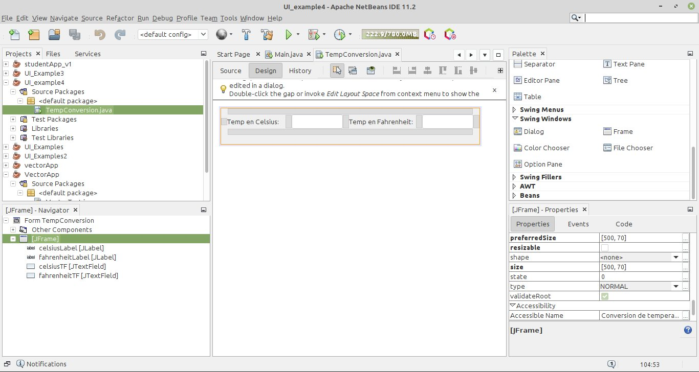
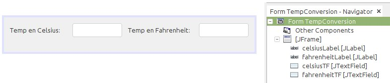

# Ejemplo 5 #

## Resumen ##
Interfaz que permite convertir grados Celsius a Fahrenheit y viceversa. Esta es la misma del ejemplo 4, solo que para el caso se empleará netbeans para el diseño de la interfaz grafica

## Interfaz  grafica ##

A continuación se tiene el diseño de la interfaz grafica empleando netbeans:

La siguiente figura muestra la jerarqua de los elementos de la figura agregada:

## Empleo ##
A continuación se muestra el programa anterior en acción:

