# Manejando arrays con clases - Ejemplos de repaso #

## Repaso rapido ##

A modo de repaso el siguiente ejemplo modela un ejemplo con clases y muestra la salida en pantalla del programa en ejecución. Su objetivo consistirá en analizarlo y entenderlo para realizar los ejercicios de programación que más abajo se proponen.

## Análisis de código ##

Codificar y comprender los siguientes ejemplos le ayudarán enormemente con los 2 ejercicios planteados.

### Ejemplo 1 ###

Los métodos también pueden devolver arrays como resultado tal y como se resalta en la siguiente figura:

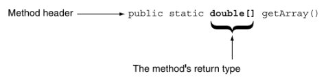

Teniendo en cuenta lo anterior codifique, ejecute y analice el archivo [ReturnArray.java](ReturnArray.java) mostrado a continuación:

```java
/**
   This program demonstrates how a reference to an
   array can be returned from a method.
*/

public class ReturnArray
{
   public static void main(String[] args)
   {
      double[] values;

      values = getArray();
      for (double num : values)
         System.out.print(num + "  ");
   }

   /**
      getArray method
      @return A reference to an array of doubles.
   */

   public static double[] getArray()
   {
      double[] array = { 1.2, 2.3, 4.5, 6.7, 8.9 };

      return array;
   }
}
```

Un caso de ejecución del programa se muestra a continuación:

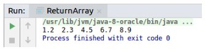

### Ejemplo 3 ###

En este ejemplo ([SalesData.java](SalesData.java)) se muestra el caso en el cual uno de los atributos de un clase es un array.   

```java
/**
   This class keeps the sales figures for a number of
   days in an array and provides methods for getting
   the total and average sales, and the highest and
   lowest amounts of sales.
*/

public class SalesData
{
   private double[] sales; // The sales data

   /**
      The constructor copies the elements in
      an array to the sales array.
      @param s The array to copy.
   */

   public SalesData(double[] s)
   {
      // Create an array as large as s.
      sales = new double[s.length];
      
      // Copy the elements from s to sales.
      for (int index = 0; index < s.length; index++)
         sales[index] = s[index];
   }

   /**
      getTotal method
      @return The total of the elements in
      the sales array.
   */

   public double getTotal()
   {
      double total = 0.0;     // Accumulator

      // Accumulate the sum of the elements
      // in the sales array.
      for (int index = 0; index < sales.length; index++)
         total += sales[index];

      // Return the total.
      return total;
   }

   /**
      getAverage method 
      @return The average of the elements
      in the sales array.
   */

   public double getAverage()
   {
      return getTotal() / sales.length;
   }

   /**
      getHighest method
      @return The highest value stored
      in the sales array.
   */

   public double getHighest()
   {
      double highest = sales[0];

      for (int index = 1; index < sales.length; index++)
      {
         if (sales[index] > highest)
            highest = sales[index];
      }

      return highest;
   }

   /**
      getLowest method
      @returns The lowest value stored
      in the sales array.
   */

   public double getLowest()
   {
      double lowest = sales[0];

      for (int index = 1; index < sales.length; index++)
      {
         if (sales[index] < lowest)
            lowest = sales[index];
      }

      return lowest;
   }
}
```

La siguiente clase ([Sales.java](Sales.java)) crea un programa de usuario con interfaz gráfica a bordo. Este programa hace uso de la clase anteriormente creada: 


```java
/**
   This program gathers sales amounts for the week.
   It uses the SalesData class to display the total,
   average, highest, and lowest sales amounts.
*/

public class Sales
{
   public static void main(String[] args)
   {
      final int ONE_WEEK = 7; // Number of elements

      // Create an array to hold sales amounts for a week.
      double[] sales = new double[ONE_WEEK];

      // Get the week's sales figures.
      getValues(sales);

      // Create a SalesData object, initialized
      // with the week's sales figures.
      SalesData week = new SalesData(sales);

      // Display the total, average, highest, and lowest
      // sales amounts for the week.
      JOptionPane.showMessageDialog(null,
         String.format("The total sales were $%,.2f\n" +
                       "The average sales were $%,.2f\n" +
                       "The highest sales were $%,.2f\n" +
                       "The lowest sales were $%,.2f",
                       week.getTotal(),
                       week.getAverage(),
                       week.getHighest(),
                       week.getLowest()));

      System.exit(0);
   }

   /**
      The getValues method asks the user to enter sales
      amounts for each element of an array.
      @param array The array to store the values in.
   */

   private static void getValues(double[] array)
   {
      String input;  // To hold user input.

      // Get sales for each day of the week.
      for (int i = 0; i < array.length; i++)
      {
         input = JOptionPane.showInputDialog(
                  "Enter the sales for day " + (i + 1) + ".");
         array[i] = Double.parseDouble(input);
      }
   }
}
```

A continuación se muestra el programa en ejecución:

* Ingreso de las ventas del dia 1:
  
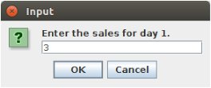

* Ingreso de las ventas del dia 2:
  
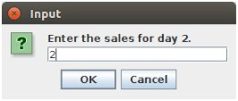

* Ingreso de las ventas del dia 3:
  
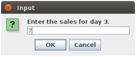

* Ingreso de las ventas del dia 4:
  
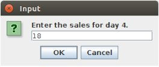

* Ingreso de las ventas del dia 5:
  
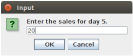

* Ingreso de las ventas del dia 6:
  
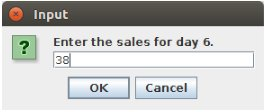

* Ingreso de las ventas del dia 7:
  
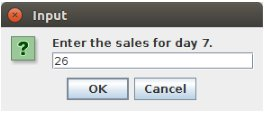

* Estadistica de ventas de la semana:

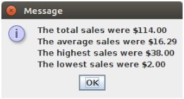

### Ejemplo 3 ###

En este ejemplo se muestra un objeto que procesa un array. El diagrama UML de la clase se muestra a continuación:

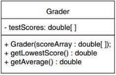

El código fuente de la clase asociada ([Grader.java](Grader.java)) al diagrama anterior se muestra a continuación:

```java

/**
   The Grader class calculates the average
   of an array of test scores, with the
   lowest score dropped.
*/

public class Grader
{
   // The testScores field is a variable
   // that will reference an array
   // of test scores.
   private double[] testScores;
   
   /**
      Constructor
      @param scoreArray An array of test scores.
   */
   
   public Grader(double[] scoreArray)
   {
      // Assign the array argument to
      // the testScores field.
      testScores = scoreArray;
   }
   
   /**
      getLowestScore method
      @return The lowest test score.
   */
   
   public double getLowestScore()
   {
      double lowest;    // To hold the lowest score
      
      // Get the first test score in the array.
      lowest = testScores[0];
      
      // Step through the rest of the array. When
      // a value less than lowest is found, assign
      // it to lowest.
      for (int index = 1; index < testScores.length; index++)
      {
         if (testScores[index] < lowest)
            lowest = testScores[index];
      }
      
      // Return the lowest test score.
      return lowest;
   }
   
   /**
      getAverage method 
      @return The average of the test scores
              with the lowest score dropped.
   */
   
   public double getAverage()
   {
      double total = 0;   // To hold the score total
      double lowest;      // To hold the lowest score
      double average;     // To hold the average
      
      // If the array contains less than two test
      // scores, display an error message and set
      // average to 0.
      if (testScores.length < 2)
      {
         System.out.println("ERROR: You must have at " +
                            "least two test scores!");
         average = 0;
      }
      else
      {
         // First, calculate the total of the scores.
         for (double score : testScores)
            total += score;
            
         // Next, get the lowest score.
         lowest = getLowestScore();
         
         // Subtract the lowest score from the total.
         total -= lowest;
         
         // Get the adjusted average.
         average = total / (testScores.length - 1);
      }
      
      // Return the adjusted average.
      return average;
   }
}
```

La clase que permite la interacción con el usuario y que contiene el método main ([CalcAverage.java](CalcAverage.java)) se muestra a continuación:

```java

import java.util.Scanner;

/**
   This program gets a set of test scores and
   uses the Grader class to calculate the average
   with the lowest score dropped.
*/

public class CalcAverage
{
   public static void main(String[] args)
   {
      int numScores;    // To hold the number of scores
      
      // Create a Scanner object for keyboard input.
      Scanner keyboard = new Scanner(System.in);
      
      // Get the number of test scores.
      System.out.print("How many test scores do you have? ");
      numScores = keyboard.nextInt();

      // Create an array to hold the test scores.
      double[] scores = new double[numScores];
      
      // Get the test scores and store them
      // in the scores array.
      for (int index = 0; index < numScores; index++)
      {
         System.out.print("Enter score #" +
                         (index + 1) + ": ");
         scores[index] = keyboard.nextDouble();
      }
      
      // Create a Grader object, passing the
      // scores array as an argument to the
      // constructor.
      Grader myGrader = new Grader(scores);
            
      // Display the adjusted average.
      System.out.println("Your adjusted average is " +
                         myGrader.getAverage());
      
      // Display the lowest score.
      System.out.println("Your lowest test score was " +
                         myGrader.getLowestScore());
      
   }
}
```

La salida del programa, para un caso específico,  se muestra a continuación:

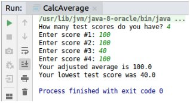