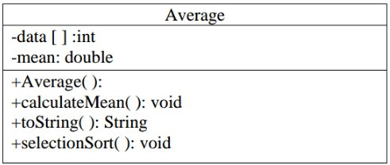

# Taller 2 #

## Problema 1 ##

La Oficina de Licencias de Conducir local le ha pedido que escriba un programa que califique la información escrita parte del examen de la licencia de conducir. El examen tiene 20 preguntas de opción múltiple. Aquí están las respuestas correctas:
1. B
2. D
3. A
4. A
5. C
6. A
7. B
8. A
9. C
10. D
11. B
12. C
13. D
14. A
15. D
16. C
17. C
18. B
19. D
20. A

Un estudiante debe responder correctamente 15 de las 20 preguntas para aprobar el examen.

Escriba una clase llamada **DriverExam** que contenga las respuestas correctas al examen en un miembro tipo array. La clase también debe tener un miembro tipo array que contenga las respuestas del estudiante. La clase debe tienen los siguientes métodos:
* **passed**: devuelve verdadero si el estudiante ganó el examen, o falso si el estudiante perdió.
* **totalCorrect**: Devuelve el número total de preguntas correctamente contestadas.
* **totalIncorrect**: Devuelve el número total de preguntas respondidas incorrectamente.
* **questionsMissed**: obtiene un array tipo int con los números de pregunta de las preguntas en las que el estudiante fallo.

Usar la clase en un programa completo que pida al usuario que introduzca las respuestas de un estudiante y luego muestre los resultados devueltos de los métodos de la clase **DriverExam**.

**Nota**: El programa deberá permitir Verificación de entrada, es decir, validar que solo se acepten letras  A, B, C o D como respuestas.

## Problema 2 ##

Crear una clase llamada promedio de acuerdo con el siguiente diagrama UML:

Esta clase deberá permitir entrar 5 datos en un array y entonces, ordenará los datos en orden descendente y calculará la media de los datos.

**Atributos**:
* **data[]**: Array que contiene los datos ingresados por el usuario.
* **mean**: Promedio de los datos ingresados.

**Métodos**:
* **Average() - constructor**: Permite asignar memoria para el array. En el constructor se espera que se lleven a cabo las siguientes instrucciones:
   1. Use un ciclo loop para solicitar repetidamente al usuario cada uno de los datos. 
   2. Cuando el usuario ingrese los datos del array, se deberá llamará llamar los métodos  **selectionSort()** y **calculateMean()**.
* **calculateMean()**: este es un método empleado para acceder a cada uno de los elementos del atributo array y su finalidad es calcular el valor promedio de estos elementos.
* **toString()**: método que retorna un String que contiene los datos en orden descendente y la media.
* **selectionSort()**: este método usa el algoritmo selection sort para organizar los datos desde el más alto al más bajo. 

Cuando la clase anterior esté lista, crear una clase llamada AverageDriver la cual contará solo con el método main. En el método main se deberá declarar e instanciar un objeto tipo Average (definido en el punto anterior) e interactuar con este de tal modo que la información asociada a este objeto sea impresa en consola.

**Nota**: para el algoritmo de ordenamiento puede emplear cualquiera. Estos se pueden encontrar en la página web del curso (google) o consultar la página 408 del capitulo del libro Programación en Java 6 de Luis Joyanes Aguilar.
